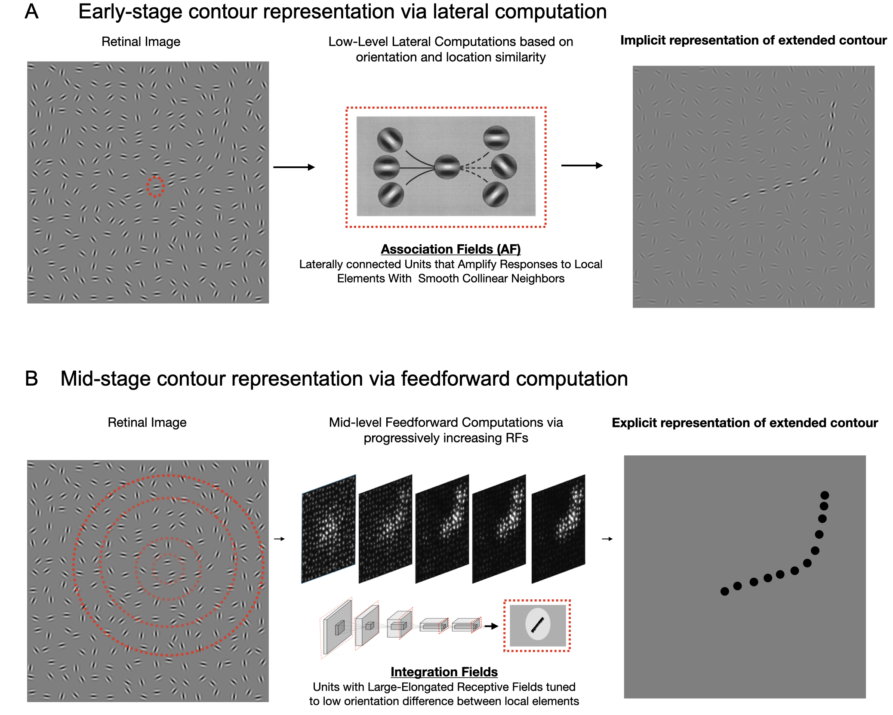

# A feedforward mechanism for human-like contour integration
***Fenil R. Doshi, Talia Konkle, and George A. Alvarez***  
*Harvard University, Dept. of Psychology*

This repository contains all the code and necessary files (datasets, model weights and psychophysics experiemnt) for the paper 'A feedforward mechanism for human-like contour integration':

# Abstract
Deep neural network models provide a powerful experimental platform for exploring core mechanisms underlying human visual perception, such as perceptual grouping and contour integration — the process of linking local edge elements to arrive at a unified perceptual representation of a complete contour. Here, we demonstrate that feedforward, nonlinear convolutional neural networks (CNNs), such as Alexnet, can emulate this aspect of human vision without relying on mechanisms proposed in prior work, such as lateral connections, recurrence, or top-down feedback. We identify two key inductive biases that give rise to human-like contour integration in purely feedforward CNNs: a gradual progression of receptive field sizes with increasing layer depth, and a bias towards relatively straight (gradually curved) contours. While lateral connections, recurrence, and feedback are ubiquitous and important visual processing mechanisms, these results provide a computational existence proof that a feedforward hierarchy is sufficient to implement gestalt "good continuation" mechanisms that detect extended contours in a manner that is consistent with human perception.




## Table of Contents

- [Description](#description)
- [Installation](#installation)
- [Usage](#usage)
- [License](#license)

## Description
This repository contains all the code and necessary files (datasets, model weights, and psychophysics experiments) for the paper 'A feedforward mechanism for human-like contour integration'. The repository contains the following folders:

* contour_integ_stimuli  - Use it to generate all contour stimuli.
* contour_integ_models   - Use it to train different kinds of feedforward contour readout models and analyze the internal activations. Additional code is provided to compute saliency maps and sensitivity to contour alignment.
* contour_integ_behavior - Use it to view unprocessed human behavioral data. Code is provided to perform psychophysics on any trained model and compare it with humans to measure human-model alignment.
* manuscript_figures     - Use it to generate all figures from the manuscript. To replicate the exact same figures, you will need access to all the model weights and the contour dataset (provided in the relevant files folder).
* relevant_files         - Contains all the necessary files - contour dataset (training, validation, and psychophysics), model weights (pretrained DNN backbone weights and contour readout weights), and code for the psychophysics experiment.


## Installation

Follow these steps to set up the repository and install all necessary dependencies:

```bash
# Clone this repository
git clone https://github.com/feziodoshi/dnn_contour_integration.git
cd dnn_contour_integration

# Install the dependencies from requirements.txt
pip install -r requirements.txt
# Install the additional GitHub dependency
pip install git+https://github.com/wielandbrendel/bag-of-local-features-models.git


# Extracting the files
mkdir -p relevant_files

# 1. Contour Dataset - Training, Validation, and Psychophysics dataset
wget -O relevant_files/temp_download.zip "https://www.dropbox.com/scl/fo/rxfzsqhkv6mw8gif7d15w/AIpDy7XSYfnlO1i8HTfBiiA?rlkey=21ifwapf46mflb25iaiy6ne2f&st=77k0pm0z&dl=1"
mkdir -p relevant_files/contour_dataset
unzip relevant_files/temp_download.zip -d relevant_files/contour_dataset/

# 2. Model Weights
wget -O relevant_files/temp_download.zip "https://www.dropbox.com/scl/fo/ambt5caokz4gybg3n19yt/AAwxCcW4ic9dw8qPL6YKYsE?rlkey=expo3ewzxohhcpj6s3t13110q&st=cd2v5lzd&dl=1"
mkdir -p relevant_files/contour_dataset
unzip relevant_files/temp_download.zip -d relevant_files/contour_dataset/


# 3. Psychophysics Experiment
wget -O relevant_files/temp_download.zip "https://www.dropbox.com/scl/fo/6x6vovfkkbmjujock9px0/AJCvNGJje1RgPQUvCOoFPq0?rlkey=48lobiml61e2m1v87rr2kayh7&st=6nuet6r9&dl=1"
mkdir -p relevant_files/psychophysics_experiment
unzip relevant_files/temp_download.zip -d relevant_files/psychophysics_experiment/
rm -rf relevant_files/temp_download.zip

# If you plan on using the existing datasets and the model weights to reconstruct manuscript figures:
# Step 1: Extract the file from the relevant files folder
tar -xvf relevant_files/<weights or dataset folder>/<filename> -C relevant_files/<weights or dataset folder>
# Step 2: Navigate to the folder of interest and move it to the parent directory (using the mv command):
# a) For model weights find the model weights folder and move it to the parent directory 
# b) For datasets you can move the model-training or model-psychophysics dataset in the relevant location. However you will have to add the absolute paths in all config files provided in each subdirectory to run the notebooks
```


## Usage

### 1) Generating new contour stimuli
```bash
cd contour_integ_stimuli
```

All required functions are present in field_stim_function.py file. To generate and render a sample set of contour stimuli, run generate_sample.ipynb. This notebook provides a quick way to generate a sample set of contour stimuli using the default parameters.
```bash
jupyter notebook generate_sample.ipynb
```

To generate new training and psychophysics stimuli, follow these steps:
Step1: Open the training_psychophysics_config.py file and update the parameters and folder locations for the training and psychophysics datasets as needed.
Step2: Run the generate_training_psychophysics.ipynb notebook. This notebook uses the updated parameters from training_psychophysics_config.py to generate new training and psychophysics stimuli.
```bash
jupyter notebook generate_training_psychophysics.ipynb
```


### 2) Training Contour Readout Model
```bash
cd contour_integ_models
```
All required python files are present in the lib folder. Here is a quick description:
* build_fe_ft_models.py - Contains code to build spliced models which are used to train readout models (fine-tuned or frozen) with different dnn backbones
* cutom_dataset.py - Contains code to make pytorch datasets for the contour stimuli
* feature_extractor.py - Contains code to hook and read activations from intermediate layers of a dnn backbone
* field_stim_function.py - Contains code to generate and render contour stimuli
* guided_backprop.py - Contains code to run guided backprop on readout (spliced) models
* misc_functions.py - Additional functions
* utility_functions.py - Additional utility functions
* receptive_fields.py - Comtains code to measure analytical receptive field size of units in intermediate layers of a dnn backbone


To train a contour readout model, follow these steps:
Step1: Open the visualdiet_basemodel_config.py file and update visual_diet_config (absolute locations and configuration of contour training stimuli) and training_config (training hyperaparameters including the dnn backbone, layer readout and finetuning mode) dictionaries.
Step2: Run the train_contour_readout.ipynb notebook. This notebook uses the updated parameters from visualdiet_basemodel_config.py to train models and save it in the 'contour_integ_models/saved_model' directory.
```bash
jupyter notebook train_contour_readout.ipynb
```

To analyse a saved model, follow these steps:
Step1: Open the visualdiet_savedmodel_config.py file and update visual_diet_config (absolute locations and configuration of contour training stimuli) and saved_model_config (location of the saved model directory) dictionaries.
Step2: Run the analyse_contour_readout.ipynb notebook. This notebook uses the updated parameters from visualdiet_savedmodel_config.py to analyse saved models (including the training, validation accuracies and losses, location sensitivity, and alignment sensitivity to contours using saliency maps and guided backprop).
```bash
jupyter notebook analyse_contour_readout.ipynb
```

### Analysing performance and contour sensitivity of trained readout model


### Analysing human-model alignment of trained readout model


## License


## Contact
If you have any questions or issues accessing the files, please contact [fenil_doshi@fas.harvard.edu](mailto:fenil_doshi@fas.harvard.edu).

